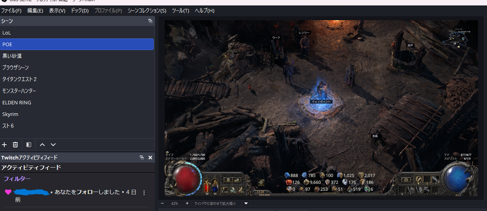

# poe2-ring-capture

**Path of Exile 2** の「エグザイルの盗みの指輪」UIをOBSオーバーレイとして表示するOBSスクリプトです。

エリア切り替え時またはホットキーで自動キャプチャし、黒背景を透明化したPNGをOBSのイメージソースとしてリアルタイム表示します。

---

> このスクリプトはLoL、黒い砂漠、POE配信者 [浅井ジークフリード](https://www.twitch.tv/asai_501xx) が自分の配信用に作成しました。

---

## スクリーンショット



---

## 必要環境

- Windows 10 / 11
- [OBS Studio](https://obsproject.com/) 28以降
- Python 3.10（OBSスクリプト用）
- pywin32

---

## インストール

### 1. Python 3.10をインストール

OBSのスクリプト機能はPython 3.10が必要です。

https://www.python.org/downloads/release/python-3100/

### 2. pywin32をインストール

```
C:\path\to\Python310\python.exe -m pip install pywin32
```

### 3. スクリプトをダウンロード

[Releases](../../releases) から最新版の `poe2_ring_capture.py` をダウンロードするか、このリポジトリをクローンします。

---

## セットアップ

### OBSの設定

**1. PythonのパスをOBSに登録**

OBS → ツール → スクリプト → 「Pythonの設定」タブ

Python 3.10のインストールパスを指定します。
例: `C:\Users\[ユーザー名]\AppData\Local\Programs\Python\Python310`

**2. スクリプトを追加**

OBS → ツール → スクリプト → `+` ボタン → `poe2_ring_capture.py` を選択

**3. スクリプト設定を入力**

| 項目               | 説明                                                                                     |
| ---------------- | -------------------------------------------------------------------------------------- |
| 解像度プリセット         | 使用モニターの解像度を選択（WQHD / FHD / 4K）                                                         |
| 出力PNG パス         | 保存先のPNGファイルパス（例: `C:\obs\ring_overlay.png`）                                            |
| 動作するシーン名         | このシーンのときだけ動作（例: `POE`）。空欄にすると常時動作                                                      |
| エリア切り替え時に自動キャプチャ | チェックを入れるとエリア移動時に自動実行                                                                   |
| Client.txt パス    | 自動キャプチャを使う場合に指定（例: `C:\Users\[名前]\Documents\My Games\Path of Exile 2\logs\Client.txt`） |
| 切り替え後の待機秒数       | エリア読み込み完了まで待つ時間（デフォルト: 0秒）                                                             |

**4. ホットキーを割り当て**

OBS → 設定 → ホットキー → 「指輪キャプチャ」に任意のキーを割り当てます。

**5. イメージソースを追加**

OBSのシーンに「イメージ」ソースを追加します。
- ファイル: 手順3で設定した出力PNGパス
- **「ファイルが変更された時に再読み込みする」にチェックを入れる**

---

## カスタム解像度の設定方法

WQHDでない解像度や座標がズレる場合は「カスタム」を選んで手動で調整してください。

### 座標の調べ方

1. POE2でキャラクター画面（Kキー）を開き、盗みの指輪にマウスを乗せてUIを表示
2. Windowsのペイントまたはスクリーンショットツールで画面を撮影
3. ペイントでマウスを各座標に合わせて数値を確認

| 設定項目 | 意味 |
|----------|------|
| 指輪アイコン X/Y座標 | 盗みの指輪アイコンの中心座標 |
| キャプチャ Left/Top | 数値UIの左上座標 |
| キャプチャ Right/Bottom | 数値UIの右下座標 |

---

## 動作の仕組み

```
ホットキー押下 or エリア切り替え検出
  → K キーを送信してキャラクター画面を開く
  → マウスを指輪アイコンの座標に移動
  → 数値UIが表示されたらスクリーンショット
  → K キーを送信して画面を閉じる
  → マウスを元の位置に戻す
  → 黒背景を透明化して PNG に保存
  → OBS のイメージソースが自動更新
```

---

## 注意事項

- **Windowsのみ対応**（win32apiを使用）
- ボーダレスフルスクリーンで動作確認済み
- ゲーム内で「K」キーにキャラクター画面以外を割り当てている場合は、スクリプト内の `VK_K = 0x4B` を該当キーのVKコードに変更してください
- 座標はゲームのUI設定（UIスケール等）によって変わる場合があります
- 仕様でホットキーをマウスに割り当てられませんが、マウスにキーを割り当てればマウスで操作できます。

---

## ライセンス

MIT
